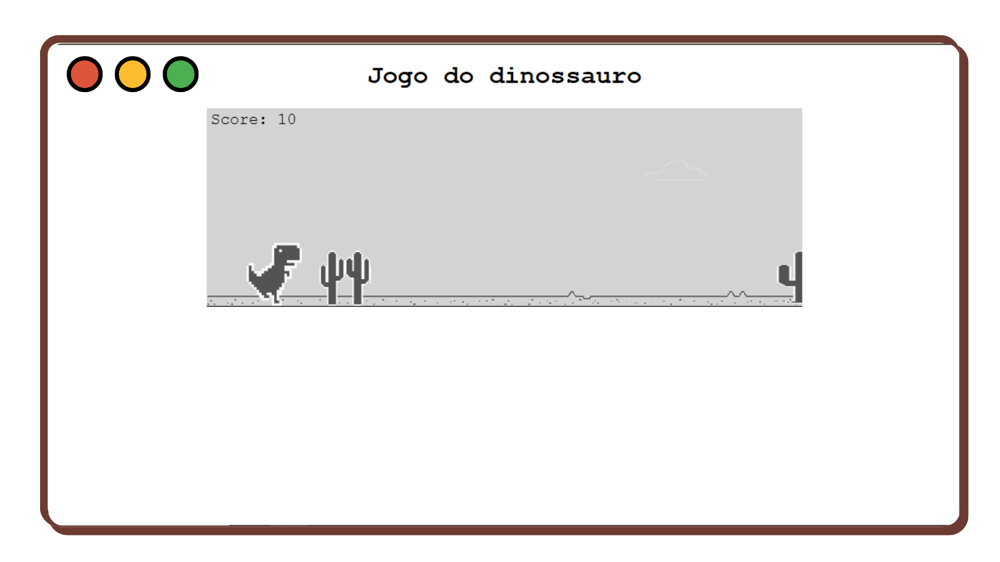
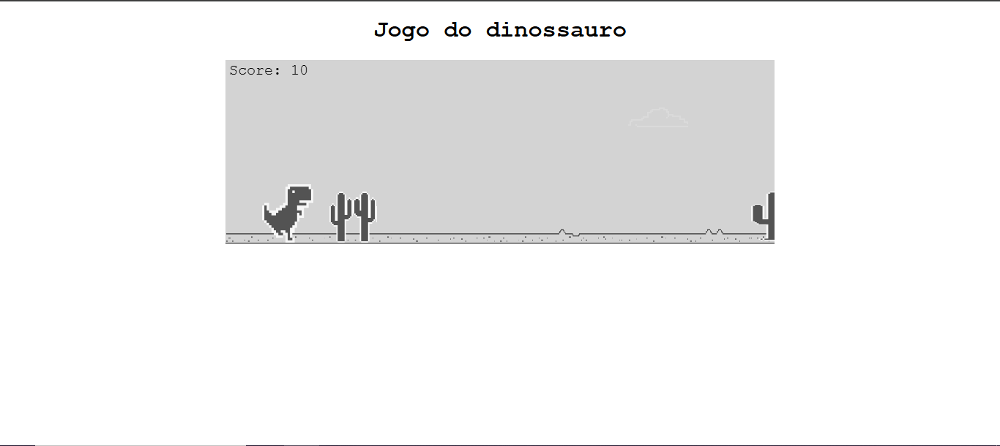
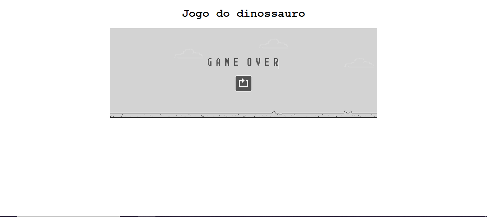

# 💼 Jogo do dinossauro
> Um remake moderno do clássico jogo do dinossauro offline da Google!

---

## 🚀 Demonstração
🔗 **Acesse o projeto:** [link-do-deploy-aqui](https://jogo-do-dinossauro-amber.vercel.app/)  

📸 **Preview:**  


---

## 📚 Sumário
- [Sobre o Projeto](#-sobre-o-projeto)
- [Tecnologias](#️-tecnologias)
- [Funcionalidades](#-funcionalidades)
- [Como Rodar o Projeto](#-como-rodar-o-projeto)
- [Como Usar](#-como-usar)
- [Screenshots](#️-screenshots)
- [Aprendizados](#-aprendizados)
- [Estrutura de Pastas](#-estrutura-de-pastas)
- [Roadmap](#-roadmap)
- [Links Úteis](#-links-úteis)
- [Autor](#-autor)
- [Licença](#-licença)

---

## 💡 Sobre o Projeto
Um remake moderno do clássico jogo do dinossauro offline da Google! Corra, pule e desvie dos obstáculos em uma gameplay divertida e infinita — feita inteiramente com **HTML, CSS e JavaScript puro**.

---

## 🛠️ Tecnologias
As principais tecnologias utilizadas neste projeto foram:

- **HTML**
- **CSS**
- **Javascript**

<div align="right">
  
  
  
  
  
</div>

---

## 📚 Funcionalidades
- [x] 🦖 Dinossauro animado com sprites
- [x] 🌵 Obstáculos aleatórios com dificuldade progressiva
- [x] 🕓 Sistema de pontuação automática
- [x] 🔄 Reinício rápido após colisão

---

## 📦 Como Rodar o Projeto
Siga as etapas abaixo para executar o projeto localmente:

```bash
# Clone este repositório
git clone https://github.com/joao-enrique/jogo-do-dinossauro.git

# Acesse a pasta do projeto
cd jogo-do-dinossauro

# Abra o projeto com o Live Server
# (Clique com o botão direito no arquivo index.html e selecione "Open with Live Server")
💡
```
> 💡 Caso não tenha o Live Server instalado, procure a extensão “Live Server” no VS Code Marketplace e instale.

---

## 🧪 Como Usar
1. Abra o jogo no navegador.
2. Jogue o jogo.

---

## 🖼️ Screenshots
### 💻 tela inicial

### 💻 tela de game over


---

## 🧠 Aprendizados
Durante o desenvolvimento deste projeto, aprimorei:
- Meus conhecimentos no `Javascript`;
- Criação de um jogo no navegador;
- Aprimoração na linguagem `Javascript` para criação de jogos.

---

## 📁 Estrutura de Pastas
jogo-do-dinossauro/ </br>
├── assets/ </br>
└── README.md </br>
---

## 🚧 Roadmap
- [] melhorar sistemas de pontos
- [] ajustar sprites

---

## 🔗 Links Úteis
🌐 Deploy: [link](https://meu-portfolio-lemon-sigma.vercel.app/)  </br>
💼 LinkedIn: [link](https://www.linkedin.com/in/joao-enrique-dev/) </br>
🧠 GitHub: [link](https://github.com/joao-enrique) </br>
🎮 Itch-io: [link](https://jedev1.itch.io/) </br>
📹 YouTube: [link](https://www.youtube.com/@joaocodedev) </br>
✨ Linktree: [link](https://linktree-eight-gules.vercel.app/) </br>

## 👨‍💻 Autor
Feito com 💜 por [João Enrique](https://linktree-eight-gules.vercel.app/)
<div align="right">
  <a href="https://www.linkedin.com/in/joao-enrique-dev/" target="_blank">
    
  </a>
  <a href="https://www.youtube.com/@joaocodedev" target="_blank">
    
  </a>
  <a href="https://jedev1.itch.io/" target="_blank">
    
  </a>
</div>

---

## 📜 Licença
Este projeto está sob a licença **MIT** — veja o arquivo [LICENCE](./LICENSE) para mais detalhes.


### ⭐ Se este projeto te inspirou, não esqueça de deixar uma **estrela** no repositório!